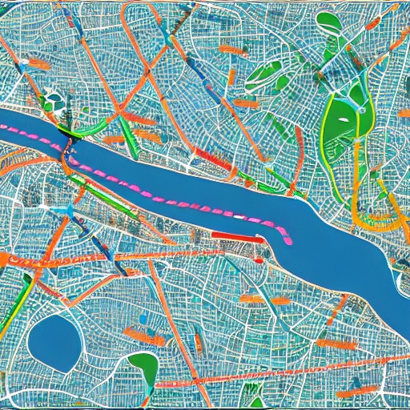
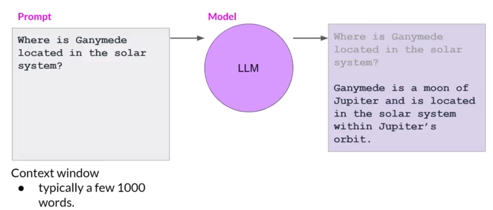
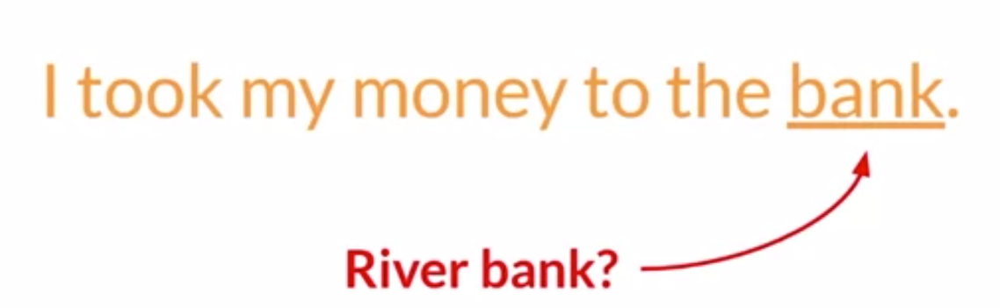
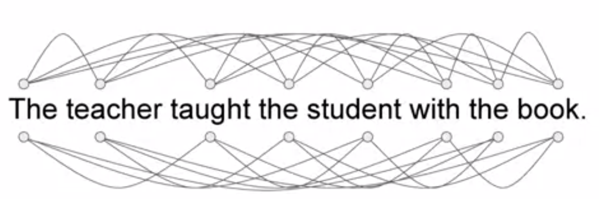
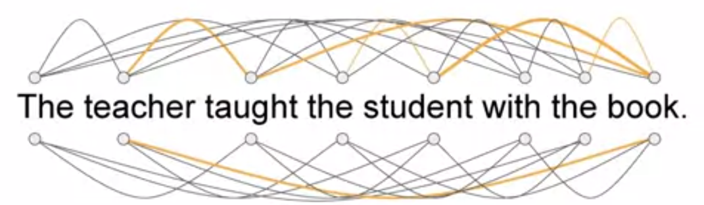
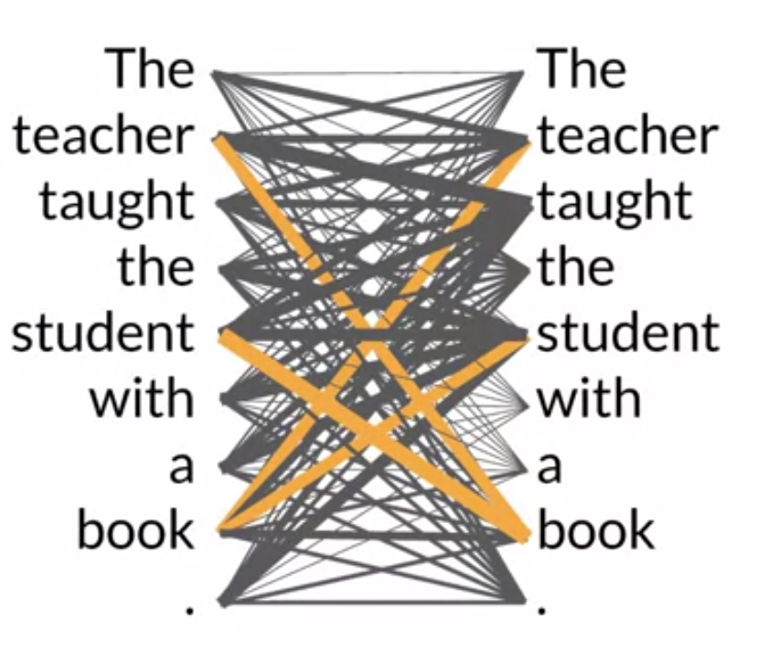

# Generative AI and Large Language Model 


### What is Generative AI ?

A machine which is capable of generating content similar to the human abilities. The generative AI is a subset of machine learning models which learns these abilities by finding and learning the statistical patterns from the massive datasets.

Examples

<table>
<tr>
<td>  </td> <td>  </td>
</tr>
<tr>
<td> <a href="https://deepai.org/machine-learning-model/text2img"> An AI tool to generate images from text</a> </td>
<td>
    


</td>
</tr>
<tr>
<td> <a href="https://deepai.org/machine-learning-model/text2img"> An AI tool to generate code from text</a> </td>
<td>
    
```python
def binary_search(lst, target):
    low = 0
    high = len(lst) - 1

    while low <= high:
        mid = (low + high) // 2
        if lst[mid] == target:
            return mid
        elif lst[mid] < target:
            low = mid + 1
        else:
            high = mid - 1

    return -1
``` 
</td>
</tr>
</table>

### Large Language Models (LLMs)

LLMs are the generative model which are trained on the massive amount of text datasets for natural language generation.

We can interact with the LLMs via prompts. The prompts are the natural language. The size of the prompt is limited by context window. The context window is different for different models.

The model takes this prompt as an input and generate a response.



### LLMs Usecases

The base idea of text generation is to predict the next word in the sequence. This simple concept can be used in many usecases and give rise to many applications/use-cases.

The weights/parameters gives model the ability process, comprehend and respond to the prompts.

1. ChatBot
2. Essay Writer
3. Text Summarization
4. Language Translation
5. Text to Code generation
6. Named Entity generation

### Text generation before transformers

Transformer architecture powers the latest advances which we see in LLMs. 

#### Text Generation with RNNs

The RNNs looks at the previous words and predicts the next work in the sequence. However, as we increase the number of previous words which can be seen by RNNs, the resouce needs to be significantly scaled up as well.
Even with this, the prediction is not good in many cases as the models doesn't have full context of the prompt.

To make a good prediction, the model needs to know more than just last few words of the sentance. 
Sometimes, the model need to have full context (document).

**Examples**




#### Transformers

Transformers architecture solved the many issues with RNNs and unlocked the true potential of LLMs. Transformers can easilty be

1. Scaled efficiently across multicore GPU.
2. Can process data parallely.
3. Introduce the attention mechanism which can learn to which part of the text/tokens are most significant. 

All of these helped to dramatically improve the performance of LLMs.
Transformer can learn the relevance and context of all of the words in a sentance as opposed to the RNNs which can only use the neighbouring words.



The relevance between the words is learned via attention weights whose magnitude signifies how important each word is to each other.



Attention map can be used to visualize the attention weights.
