# Attention Models

## Neural Machine Translation (NMT)

NMT is a task where the machine needs to translate from one human language to another.
It uses encoder and a decoder architecture to translate from one language to another.

Example: English-to-German

### NMT using LSTM

NMT using LSTM/GRU are done using a Seq2Seq model. 
* These models map a variable length input sequence to a fixed-length memory using an encoder.
* The encoded output is then fed to a decoder which can generates the output.
* The models can have different length of inputs and outputs which is often required for machine translation.
* LSTM/GRU are used to avoid vanishing and exploding gradients problem for long sequences.

    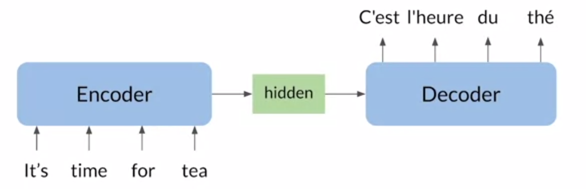

#### Seq2Seq Encoder

The word of the sentance is called as *token*. The token are converted to a fixed size vector using an embedding layer. The embedded input along with hidden state is passed to the LSTM cell to generate a new hidden state which encodes the information from previous cell.

    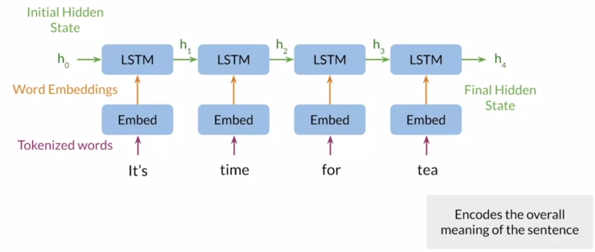

#### Seq2Seq Decoder

The final hidden state of the encoder is passed to the decoder with specialized start of sequence *SOS* token to kick of the translation.

    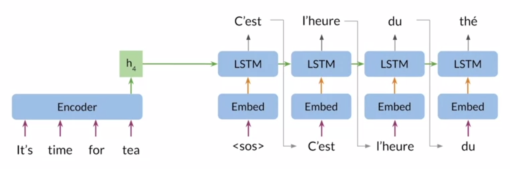

#### Information bottleneck

The main issue with Seq2Seq models is the fixed size memory. For longer sequences, the fixed size memory is enough to pass the whole information from encoder to decoder.

    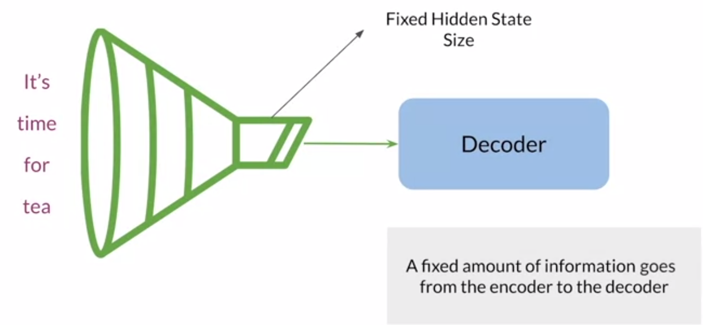

As the sequence size increases, the fixed size memory is not able to compress/retain the information in longer sequences leading to poor model performance.

#### Information bottleneck - Solution 1

Instead of using the final/compressed hidden state, use all the hidden states in the decoder.
However, this would require huge amount of memory for long sequences.

    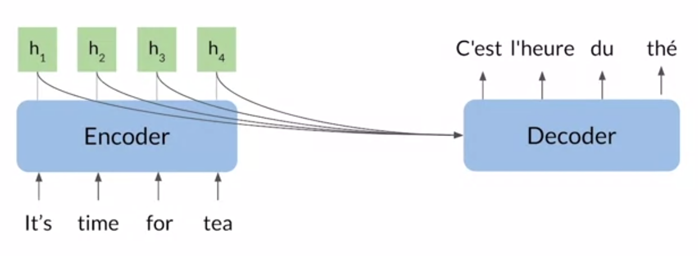

#### Information bottleneck - Solution 2 - Attention

We can add an attention layer which can learn to attend which hidden state is most important in the sequence.

    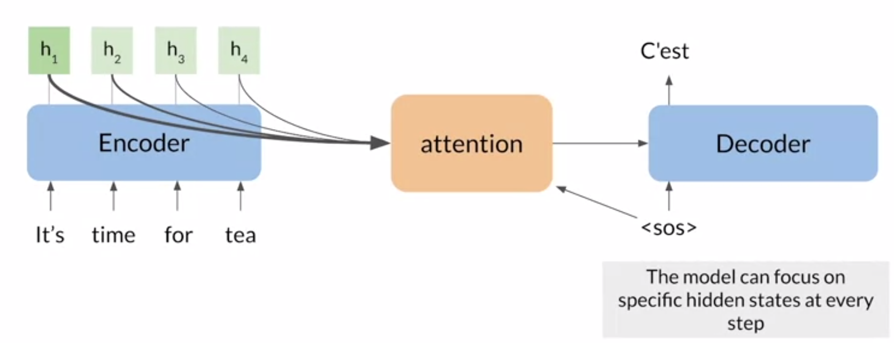

#### Performance of Attention Seq2Seq models

Given enough fixed size memory, the models with attention outperformed the existing non attention based models.

    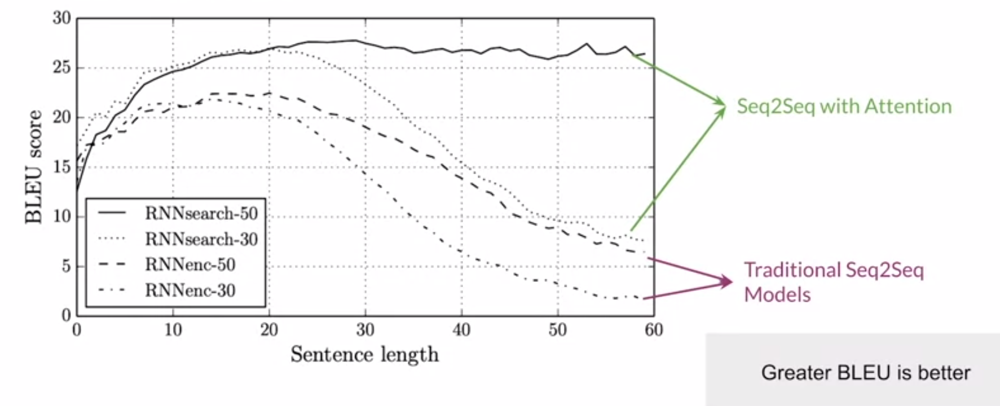

#### How to use all hidden states ?

It is now well established that, passing all the hidden state to decoder instead of compressing all the hidden state into single hidden state is more usefull. But the question remains, how to do it efficiently without blowing up the memory and compute requirements.

    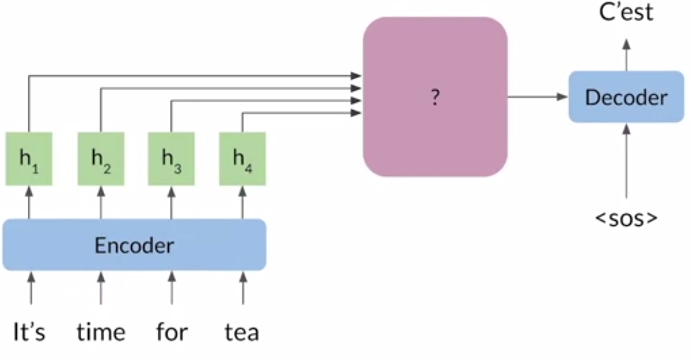

One of the naive way is to do a pointwise addition of all hidden state into one single fixed size vector called as context vector.
This is not optimal, as not all the information is required for predicting every word. For example: for initial words, only initial hidden states are useful.

    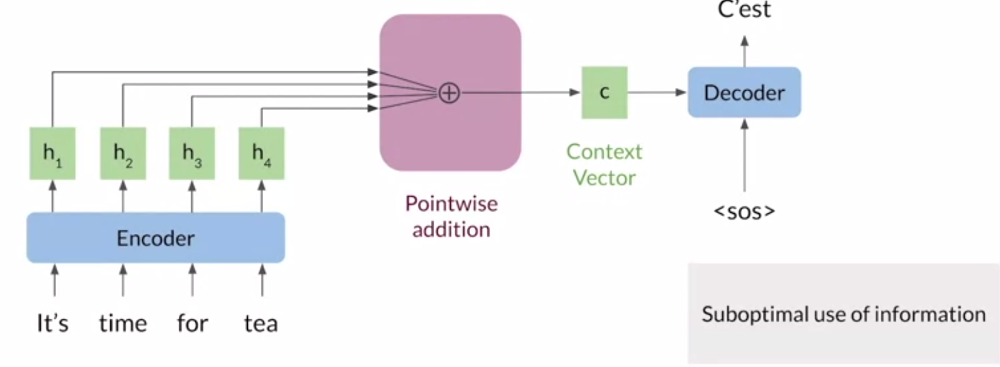

Another way is it to learn a weighted sum instead of doing pointwise addition. This gives network the ability to learn which part of the sentance is more relevant based on the context.

    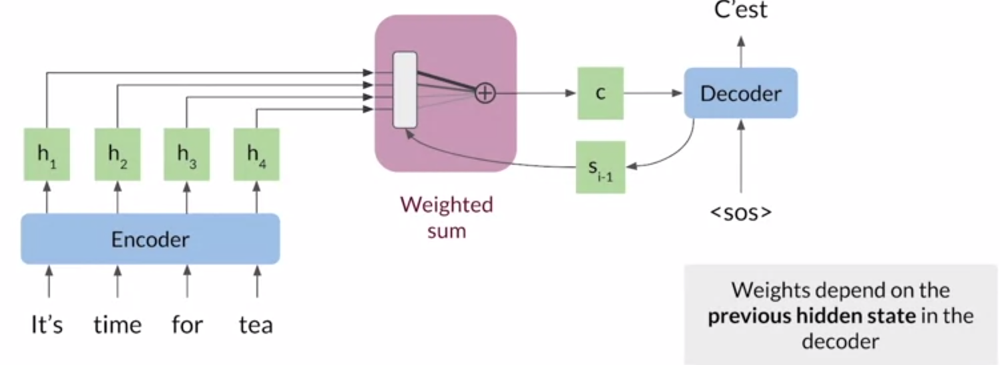

The attention layers takes the current decoder state $s_{i-1}$ as the input along with the encoder hidden state $h_{j}$ to come up with a score $e_{ij}$ for each hidden state, where $i$ is ith token of the sequence and $j$ represents all possible hidden states.

The score is then converted to probablity distribution over all encoder hidden states using software. 

Finally, the context vector $c$ is called as the weighted sum of the hidden states where the weights are calculated using softmax.

    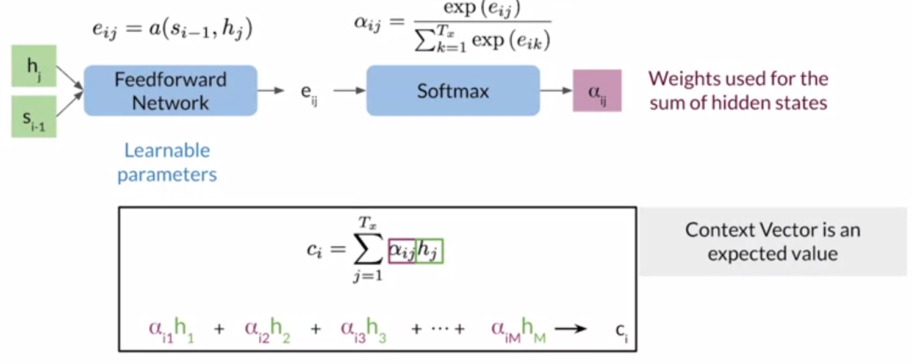

Since the attention paper is published, there have been many variants of attention mechanism. 
The most popular one is as Transformers was published in paper titled [Attention Is All You Need](https://arxiv.org/abs/1706.03762) in 2017.
