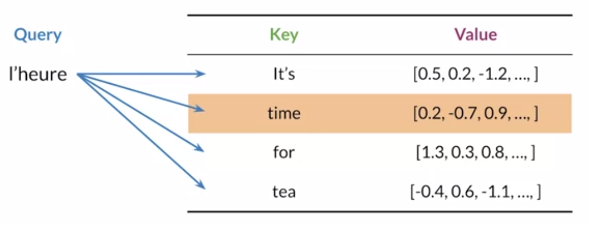
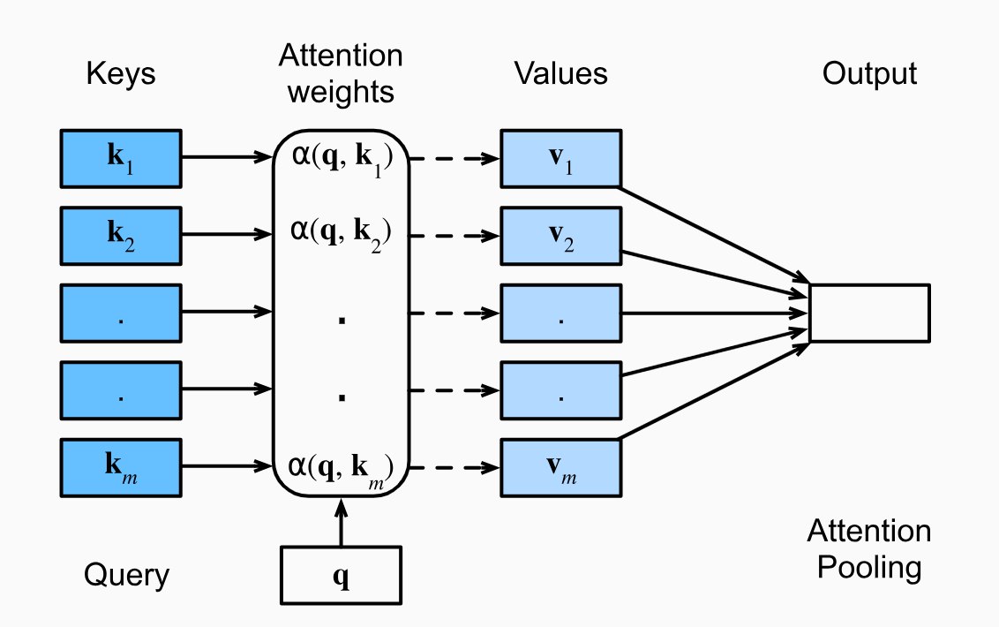

# Transformers

The transformer model introduces a form of attention based on the idea of information retrieval.

It introduced the below terms

* Queries, Keys and Values
* Alignment

## Queries, Keys and Values

The Key and Value can be thought of as a look up table which maps the keys to its values. A query is performed in the table which is mapped to similar keys and the corresponding values are returned.

For example, in language translation task, the query is the token in one language which is matched to the corresponding token in the another language.

    

Queries, Keys and Values are represented using embedding vectors. Due to this, the queries, keys and values are not exact match every time. However, the network learn similar keys, queries and values for the similar words.

Consider a database $\mathcal{D} = \left \{ (k_{1}, v_{1}), (k_{2}, v_{2}),...,(k_{m}, v_{m}) \right \}$ with $m$ tuples of keys and value pairs.
A query performed on the $\mathcal{D}$ is denoted by $q$. Then the attention over $\mathcal{D}$ is defined as 

$$ \text{Attention}(\mathcal{D}, q) = \sum_{i=1}^{m} \alpha(q, k_{i})v_{i} $$

where $\alpha(q, k_{i}) \in \mathcal{R}$ are the scalar attention weights and $\alpha(q, k_{i})$ is function which calculates similarity between the two. The attention name is dervied from the fact that the operation focuses more on the terms whose $\alpha$ values are larger. Attention over $\mathcal{D}$ generates a linear combination of values contained in the database. 

---
**NOTE**

A convex combination is a linear combination of points $x_{1}, x_{2}, ... , x_{n}$ in real vector space,

$$ \lambda_{1}x_{1} + \lambda_{2}x_{2} + ... + \lambda_{n}x_{n} $$

where $ \forall \lambda_{i} \geq 1 $ and $\lambda_{1} + \lambda_{2} + ... + \lambda_{n} = 1$

---
We typically use the below setting in deep learning
* The weights $\alpha(q, k_{i})$ form a convex combination, i.e. $\sum_{i=1}^{m} \alpha(q, k_{i}) = 1$ and $\alpha(q, k_{i}) \geq 1 $

Other variants

* If exactly one of the weight $\alpha(q, k_{i})$ is 1, while all others are zero. This is akin to a traditional database query.

* If all weights are equal, i.e. $\alpha(q, k_{i}) = \frac{1}{m} $ for all $i$. This amounts to equal averaging across entire database, similar to average pooling.

To make sure the attention weights sum up to 1, we can normalize them

$$ \alpha(q, k_{i}) = \frac{\alpha(q, k_{i})}{\sum_{j=1}^{m} \alpha(q, k_{j})} $$

To make sure the weights are always non-negative and sum up to one, we can use softmax. Due to this, $\alpha(q, k_{i})$ can be replaced by any $a(q, k_{i})$ function.

$$ \alpha(q, k_{i}) = \frac{exp(a(q, k_{i}))}{\sum_{j=1}^{m} exp(a(q, k_{j}))} $$

    

### Scaled dot product attention

#### Scoring function

One of the way to calculate the similarity between keys and queries is to use dot product. This is commonly used attention scoring function in transformers.

In practice, the query $q \in \mathcal{R}^{d}$, and the $k_{i} \in \mathcal{R}^{d}$ are all drawn randomly from zero mean and unit variance. The resulting dot product will have zero mean and variance $d$. These attention scores are further converted into probality by passing it through softmax. It was noted that without scaling, the softmax is pushed into the regions where gradient is very small. Hence, scaling by $d$ allows to counteract this effect.

$$ a(q, k_{i}) = \frac{q^{\mathsf{T}}k_{i}}{\sqrt{d}} $$

#### Calculating weights

Once the scoring values are available for each keys $k_{i}$, those are converted into weights and multiplied by the values to come up with final attention values

$$ \alpha(q, k_{i}) = \text{softmax}(a(q, k_{i})) = \frac{exp(a(q, k_{i}))}{\sum_{j} exp(a(q, k_{j})) } $$

In general, both queries and keys are required to have the same vector length, say $d$. 

Let's assume computing attention for $n$ queries, and $m$ key-value pairs, where the queries and keys are of length $d$ and values are of length $v$. 
The scaled dot product of queries $\mathbf{Q} \in \mathcal{R}^{n \times d}$, keys $\mathbf{K} \in \mathcal{R}^{m \times d}$ and values $\mathbf{V} \in \mathcal{R}^{m \times v}$ can be written as 

$$ \text{softmax} \left ( \frac{QK^{\mathbf{T}}}{\sqrt d} \right ) V \in \mathcal{R}^{n \times v} $$

The above implemenation is for single batch but can be extended to multi-batch as well.
